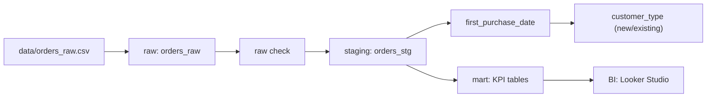
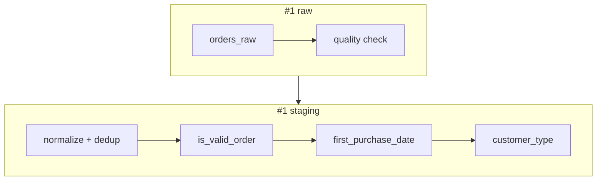

# EC Sales Data Lifecycle Project

EC売上データ（架空）を使って、入社〜1年目レベルのデータ職（データアナリスト／データエンジニア）が行う **実務フロー（raw → staging → mart → BI）** を再現するポートフォリオです。
「分析結果を断言する」よりも、**分析できる状態を作る（設計・整形・品質・再現性）** ことを重視しています。

---

## 目的

- 実務フロー（raw → staging → mart → BI）を再現し、業務理解を示す
- SQLによる整形・集計能力の証明（主目的の次点）
- データ品質設計（事故検知・監視・定義固定）の理解
- 「分析できる状態」を作る（架空データのため施策の正解は断言しない）

---

## 成果物（3部構成）

本プロジェクトは **1つのリポジトリ** で管理しつつ、成果物として **#1〜#3** に分割して提示します。

### #1 整形・品質管理（raw / staging）

- 目的：取り込み事故検知と、整形・品質監視（分析対象の固定）
- 成果物：品質チェックSQL、staging生成SQL、定義（is_valid_order / first_purchase_date / new/existing）
- ドキュメント：`docs/portfolio_01_raw_staging.md`
- SQL：`sql/01_raw/` `sql/02_staging/`

#### stagingの固定定義（抜粋）

> 実行結果サマリ：raw 213行 → staging 212行（完全重複1行を除去）、is_valid_order=1:169 / 0:43（KPI対象/対象外）

- `is_valid_order = 1` 条件（KPI対象）

  - order_id / customer_id が空でない
  - order_date がNULLでなく未来日でない
  - quantity, unit_price, amount が正（> 0）
  - status = 'PAID'
- `customer_type`（新規/既存）

  - 初回購入月（valid注文前提）= 注文月 → `new`
  - それ以外 → `existing`

---

### #2 KPI集計・検算（mart）

- 目的：stagingで整えたデータから、月次KPIを再現可能に作成し、**定義・粒度・集計条件・検算観点**を明確化する（「分析結果の断言」ではなく「分析できる状態」を作る）
- 入力 / 出力：
  - input：`ec_sales.orders_stg`
  - output：`ec_sales.kpi_monthly`
- ドキュメント：`docs/portfolio_02_mart_kpi.md`
- SQL：`sql/03_mart/`

#### 最小KPI（定義固定）

- 売上：`SUM(amount)`
- 注文件数：`COUNT(DISTINCT order_id)` ※明細粒度のためDISTINCT必須
- 購入者数：`COUNT(DISTINCT customer_id)`
- AOV：`SAFE_DIVIDE(SUM(amount), COUNT(DISTINCT order_id))`
- ARPU：`SAFE_DIVIDE(SUM(amount), COUNT(DISTINCT customer_id))`

#### 成果物（SSOT）

- 作成：`sql/03_mart/01_create_kpi_monthly.sql`
- 検算：`sql/03_mart/02_validate_kpi_monthly.sql`
- 根拠（DISTINCT確認）：`sql/03_mart/03_validate_distinct_logic.sql`

#### 検算の考え方（要点）

- `orders_stg` は 1行=注文明細のため、注文件数は `COUNT(*)` ではなく `COUNT(DISTINCT order_id)` で算出する
- 検算SQLで `sales_amount / order_count / customer_count` が一致すること（差分が0）を確認する

---

### #3 可視化まで整備（BI）

- 目的：「分析する」ではなく「分析できる状態」に整える
- 成果物：BI用view（任意）、ダッシュボード仕様、最低限のダッシュボード
- ドキュメント：`docs/portfolio_03_bi_analysis_ready.md`（作成予定）
- 資料：`viz/`

---

## 技術スタック

- DWH：BigQuery
- SQL実行：BigQuery Console
- 可視化：Looker Studio（#3で使用）
- Git管理：GitHub
- Python：pandas（品質チェック補助用途。必須ではなく補助）

---

## データ設計（確定ルール）

- 粒度：`orders` は **1行 = 注文明細（order_id × product_id）**
- KPI対象：原則 `is_valid_order = 1`
- 新規/既存：**初回購入月ベース（valid注文前提）**

---

## ディレクトリ構成

- `docs/`：設計・まとめ（#1〜#3）
- `sql/`：SQL（raw / staging / mart / analysis-ready）
- `data/`：公開可能な架空データのみ
- `viz/`：ダッシュボード仕様・スクショ等

---

## 実行順序（要約）

1. raw作成 → CSV取り込み → raw品質チェック
2. staging生成 → staging品質チェック（is_valid_order / first_purchase_date / customer_type）
3. mart作成（KPI）＋検算
4. Looker Studioで可視化（分析可能状態）

---

## 再現手順（最短）

このリポジトリは **BigQuery上でSQLを実行して再現**します（ローカル実行は不要）。

### 1) データ取り込み（raw）

1. BigQueryでデータセット `ec_sales` を作成
2. `data/orders_raw.csv` をアップロードして `ec_sales.orders_raw` を作成
   - Source: Upload（CSV）
   - Table: `orders_raw`
   - Schema: Auto-detect

### 2) #1 raw → staging（品質チェック / 整形 / 定義固定）

以下の順でSQLを実行します（BigQuery Console）。

- `sql/01_raw/01_raw_quality_check.sql`
- `sql/01_raw/02_raw_duplicate_check.sql`
- `sql/02_staging/01_create_orders_stg.sql`
- `sql/02_staging/02_add_first_purchase_date.sql`
- `sql/02_staging/03_add_customer_type.sql`

**出力テーブル**

- `ec_sales.orders_raw`（raw）
- `ec_sales.orders_stg`（staging：is_valid_order / first_purchase_date / customer_type を保持）

### 3) #2 mart（KPI作成・検算）

以下の順でSQLを実行します（BigQuery Console）。

- `sql/03_mart/01_create_kpi_monthly.sql`（`ec_sales.kpi_monthly` を作成）
- `sql/03_mart/02_validate_kpi_monthly.sql`（検算：staging再集計 vs mart）
- `sql/03_mart/03_validate_distinct_logic.sql`（根拠：COUNT(*) と COUNT(DISTINCT) の差を確認）

**出力テーブル**

- `ec_sales.kpi_monthly`（mart：月次KPI）

### 4) #3 BI（作成予定）

Looker Studioで「分析できる状態」に整えるダッシュボードを追加予定。

BI用 view：v_kpi_monthly, v_kpi_monthly_by_category
SQL：sql/04_analysis_ready/

---

## 補足

- `data/` 配下のデータは **架空データ** です。
- 本リポジトリは「業務フロー理解・再現性・定義固定」を重視して作成しています。
